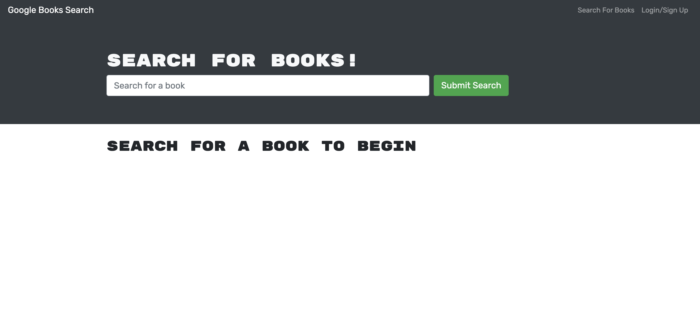
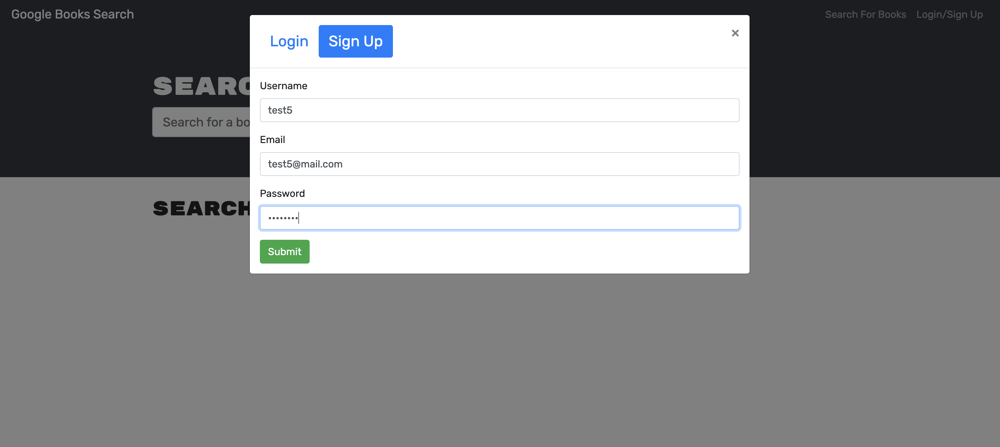
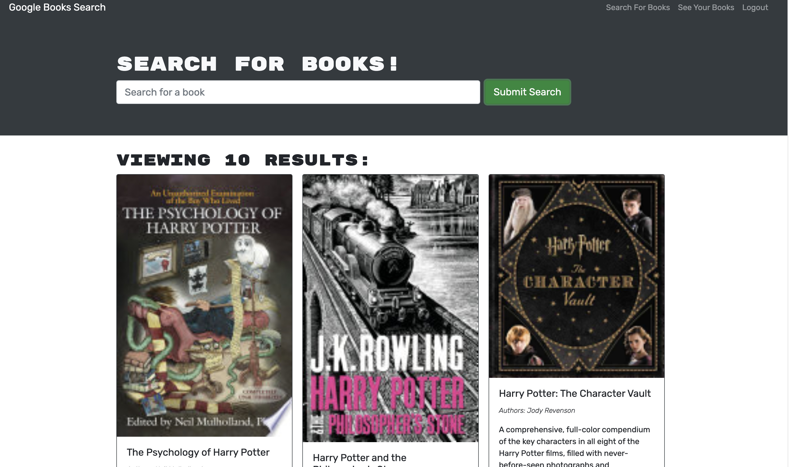
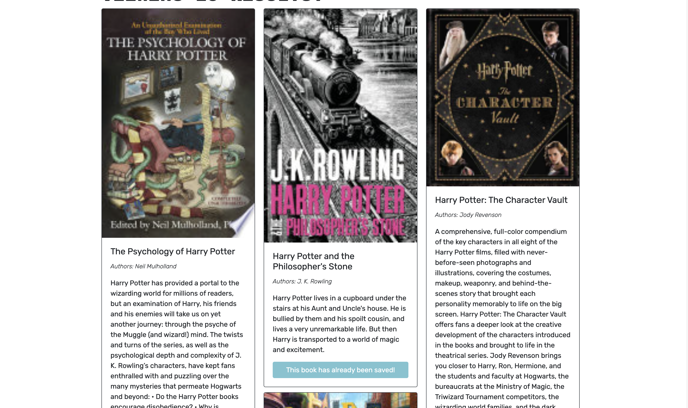

# Reading List
  
## Description

This application is a reading list where you can save your favourite books or for a future reading list to your personal list and remove them when the user is done them.

## Table of Contents

- [Installation Instructions](#installation)
- [Usage](#usage)
- [Questions](#questions)

## Installation

In the client and server directory run:
npm install

## Usage

## Questions

If you have any questions regarding the status of this project or any concerns please refer to my GitHub repo:
[leunggerry](https://github.com/leunggerry)